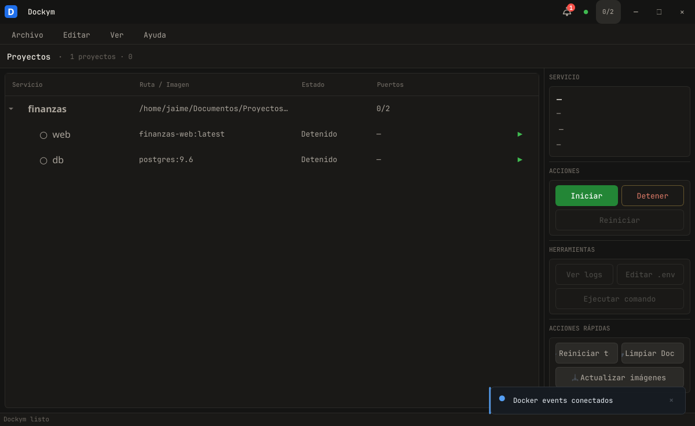
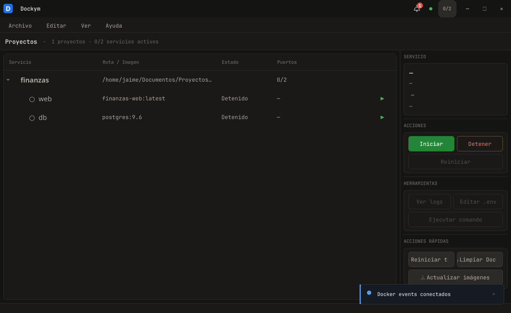
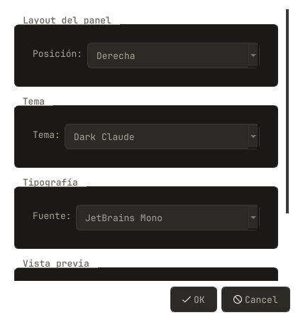
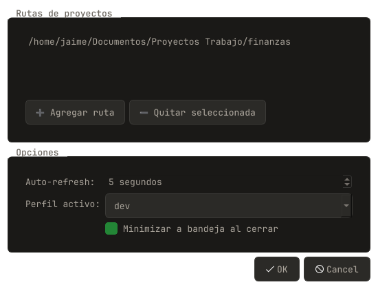
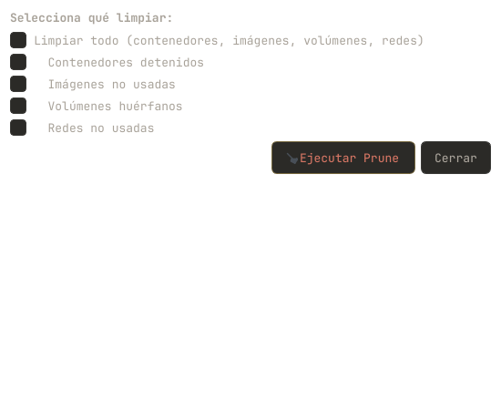

<div align="center">

# 🐳 Dockym

**Gestor visual de servicios Docker Compose**

Una aplicación de escritorio nativa (PySide6) para administrar tus contenedores Docker y proyectos Compose sin tocar la terminal.

[](https://github.com/jaimepa17/dockym/actions/workflows/build.yml)
[](https://github.com/jaimepa17/dockym/actions/workflows/publish-pypi.yml)
[](https://pypi.org/project/dockym/)
[](https://pypi.org/project/dockym/)
[](LICENSE)
[](https://github.com/jaimepa17/dockym/releases)

</div>

---

## ✨ Instalación

### Opción 1 — Una línea (recomendada)

```bash
curl -fsSL https://raw.githubusercontent.com/jaimepa17/dockym/main/install.sh | bash
```

El script detecta automáticamente tu plataforma y elige el método más rápido disponible:

| Prioridad | Método | Descripción |
|-----------|--------|-------------|
| 🥇 | **Binario** | Descarga el ejecutable pre-compilado (GitHub Release) — sin dependencias |
| 🥈 | **uv** | `uv tool install dockym` — más rápido |
| 🥉 | **pip** | `pip install dockym` — universal |

> **Flags útiles**: `--binary` (forzar binario), `--uv` (forzar uv), `--pip` (forzar pip), `--version 0.1.0` (versión específica), `--uninstall` (desinstalar).

### Opción 2 — pip (desde PyPI)

```bash
pip install dockym
dockym
```

### Opción 3 — uv

```bash
uv tool install dockym
dockym
```

### Opción 4 — Binario standalone

Descarga el binario desde [GitHub Releases](https://github.com/jaimepa17/dockym/releases):

```bash
# Linux
tar xzf dockym-linux-x86_64.tar.gz
./Dockym

# macOS
unzip dockym-macos-arm64.zip
open Dockym.app
```

### Opción 5 — Desde código fuente

```bash
git clone https://github.com/jaimepa17/dockym.git
cd dockym
uv sync
uv run dockym
```

---

## Capturas

<!-- 
  🖼️ Para agregar más capturas:
  Toma screenshots de la app y guárdalas en assets/screenshots/.
  Luego agrégalas a la tabla de abajo.

  Sugerencias:
  - main-window     — Ventana principal con project tree + action panel
  - command-palette — Command palette (Ctrl+F)
  - themes          — Tema claro vs oscuro
  - notifications   — Stack de toasts
  - logs            — Visor de logs
  - settings        — Diálogo de configuración
  - templates       — Diálogo de plantillas de servicios
  - prune           — Diálogo de Docker prune
-->

<table>
  <tr>
    <td></td>
    <td></td>
  </tr>
  <tr>
    <td align="center"><em>Ventana principal</em></td>
    <td align="center"><em>Command palette (Ctrl+F)</em></td>
  </tr>
  <tr>
    <td></td>
    <td></td>
  </tr>
  <tr>
    <td align="center"><em>Selector de tema</em></td>
    <td align="center"><em>Configuración</em></td>
  </tr>
  <tr>
    <td></td>
    <td></td>
  </tr>
  <tr>
    <td align="center"><em>Docker Prune</em></td>
    <td></td>
  </tr>
</table>

---

## Características

### 🖥️ Interfaz nativa
- **Ventana frameless** con barra de título personalizada, arrastre nativo, redimensionado desde bordes
- **Barra de menú** completa con atajos de teclado
- **System tray** con minimizar al cerrar
- **Soporte HiDPI** con escalado automático (PassThrough)
- **4 temas visuales**: Dark (GitHub-dark), Dark VS Code, Dark Claude, Light
- **Notificaciones toast** animadas con auto-descarte y pausa al hover
- **Panel de acciones** configurable (derecha, izquierda, abajo)

### 🐳 Gestión de Docker
- **Escaneo automático** de directorios en busca de archivos `docker-compose.yml` / `compose.yaml`
- **Árbol de proyectos y servicios** con estados en vivo (running, stopped, paused, etc.)
- **Iniciar / Detener / Reiniciar** servicios individuales o proyectos completos
- **Operaciones por lote**: iniciar, detener, reiniciar o eliminar múltiples contenedores
- **Ver logs** en tiempo real con salida monospace
- **Ejecutar comandos** dentro de contenedores (`exec`)
- **Editor de `.env`** inline
- **Prune** de contenedores, imágenes, volúmenes y redes (con confirmación)
- **Pull** de imágenes para todos los servicios
- **Reiniciar todos** los contenedores activos

### ⚡ Productividad
- **Command palette** (Ctrl+F) para buscar y navegar entre proyectos/servicios al instante
- **Auto-refresh** configurable (por defecto cada 5s)
- **Eventos en vivo** — la UI se actualiza automáticamente cuando un contenedor cambia de estado
- **Plantillas de servicios** (MySQL, PostgreSQL, Redis, MongoDB, Nginx, Node.js, Adminer, Mailpit) — agrega servicios a tu compose con un clic
- **Exportar/Importar** configuración como JSON
- **Atajos de teclado**:
  | Tecla          | Acción                     |
  |----------------|----------------------------|
  | `Ctrl+F`       | Command palette            |
  | `Ctrl+E`       | Exec en contenedor         |
  | `Ctrl+L`       | Ver logs                   |
  | `Ctrl+R`       | Reiniciar servicio         |
  | `F5`           | Refrescar                  |
  | `Ctrl+,`       | Configuración              |
  | `Ctrl+Shift+A` | Apariencia                 |
  | `Ctrl+Q`       | Salir                      |

### 🔧 Técnicas
- **Cliente Docker thread-safe** con singleton, health checks y backoff exponencial
- **Auto-detección** de socket Docker (estándar, Snap, rootless, Podman)
- **Auto-detección** de Compose V2 vs V1
- **Caché de parsing YAML** con validación por mtime + TTL
- **Worker pool** con `QThreadPool` para operaciones en segundo plano
- **Iconos 100% vectoriales** renderizados con QPainter — sin assets externos
- **Config atómica** con temp file + `os.replace()`

---

## Guía de uso rápido

### 1. Escaneo inicial

Al abrir Dockym, escanea automáticamente los directorios configurados en busca de archivos Compose. Los proyectos aparecen en el panel izquierdo con sus servicios.

> 💡 **Tip**: Puedes agregar/quitar directorios en *Edit → Settings* (Ctrl+,).

### 2. Gestiona tus servicios

| Acción                        | Cómo                                        |
|-------------------------------|---------------------------------------------|
| ▶️ Iniciar servicio           | Click ▶️ en la fila o selecciona y da Start |
| ⏹️ Detener servicio           | Click ⏹️ en la fila o selecciona y da Stop  |
| 🔄 Reiniciar                  | Click 🔄 o pulsa Ctrl+R                     |
| 📋 Ver logs                   | Selecciona el servicio → Tools → Logs       |
| 💻 Executar comando           | Selecciona → Tools → Exec (Ctrl+E)          |
| ✏️ Editar .env                | Selecciona → Tools → .env                   |
| 🗑️ Prune Docker              | Action panel → Quick actions → Prune        |

### 3. Command palette

Pulsa **Ctrl+F** para abrir la paleta. Escribe el nombre de un proyecto o servicio para saltar directamente a él.

### 4. Plantillas de servicios

Ve a **File → Add service from template** y elige entre MySQL, PostgreSQL, Redis, MongoDB, Nginx, Node.js, Adminer o Mailpit. El servicio se agrega a tu archivo Compose activo.

---

## Configuración

La configuración se guarda en `~/.config/dockym/config.json`.

| Opción              | Tipo     | Defecto        | Descripción                            |
|---------------------|----------|----------------|----------------------------------------|
| `paths`             | `[str]`  | `["~/Documentos"]` | Directorios a escanear            |
| `active_profile`    | `str`    | `"dev"`        | Perfil activo                          |
| `refresh_interval`  | `int`    | `5`            | Intervalo de auto-refresh (segundos)   |
| `minimize_to_tray`  | `bool`   | `true`         | Minimizar a bandeja al cerrar          |
| `panel_position`    | `str`    | `"right"`      | Posición del panel (`right`, `left`, `bottom`) |
| `theme`             | `str`    | `"dark"`       | Tema visual                            |
| `font_family`       | `str`    | `"Inter"`      | Fuente de la interfaz                  |

---

## Desarrollo

### Setup

```bash
git clone https://github.com/jaimepa17/dockym.git
cd dockym
uv sync --dev
```

### Modo dev con auto-reload

```bash
uv run python tools/dev.py
```

El proyecto usa `watchfiles` para reiniciar automáticamente la app cuando detecta cambios en `src/dockym/`.

Flags disponibles:
| Flag          | Descripción                        |
|---------------|------------------------------------|
| `--once`      | Ejecuta una vez, sin file watcher  |
| `--offscreen` | Modo headless (para testing)       |
| `--verbose`   | Muestra eventos de cambio de archivos |

### Formato y linting

El proyecto usa [Ruff](https://docs.astral.sh/ruff/). Ejecuta:

```bash
ruff check src/
ruff format src/
```

---

## Arquitectura

```
src/dockym/
├── __init__.py          # Entry point → main()
├── __main__.py          # python -m dockym
├── app.py               # QApplication, iconos, run loop
├── engine/              # Core Docker engine
│   ├── client.py        # Cliente Docker thread-safe (singleton)
│   ├── compose.py       # Ejecutor async de docker compose
│   ├── events.py        # Monitor de eventos Docker en vivo
│   ├── scanner.py       # Escáner de archivos Compose con caché
│   └── templates.py     # 8 plantillas de servicios
├── models/              # Modelos de datos
│   ├── config.py        # Config + persistencia JSON
│   └── project.py       # Project & Service dataclasses
├── ui/                  # Interfaz de usuario
│   ├── main_window.py   # Ventana principal + orquestación
│   ├── title_bar.py     # Barra de título frameless
│   ├── service_table.py # Árbol de proyectos/servicios
│   ├── action_panel.py  # Panel de acciones contextual
│   ├── command_palette.py # Búsqueda global (Ctrl+F)
│   ├── notification.py  # Toast + Notification Center
│   ├── theme.py         # Generador de QSS (4 temas)
│   ├── icons.py         # Todos los iconos (QPainter)
│   ├── exec_dialog.py   # Diálogo exec
│   ├── logs_dialog.py   # Visor de logs
│   ├── env_dialog.py    # Editor .env
│   ├── prune_dialog.py  # Diálogo de prune
│   ├── settings_dialog.py   # Configuración
│   ├── appearance_dialog.py # Apariencia (tema/fuente)
│   ├── template_dialog.py   # Selector de plantillas
│   ├── export_dialog.py     # Export/Import JSON
│   └── tray_manager.py  # Bandeja del sistema
└── workers/             # Operaciones en segundo plano
    └── docker_worker.py # QThreadPool workers
```

---

## Tecnologías

| Tecnología       | Versión | Propósito                    |
|------------------|---------|------------------------------|
| Python           | ≥ 3.11  | Lenguaje principal           |
| PySide6          | ≥ 6.7   | UI nativa (Qt6)              |
| Docker SDK       | ≥ 7.0   | API de Docker                |
| PyYAML           | ≥ 6.0   | Parseo de archivos Compose   |
| uv               | —       | Gestor de dependencias       |
| PyInstaller      | ≥ 6.0   | Build standalone (opcional)  |

---

## Contribuir

Las contribuciones son bienvenidas. Por favor:

1. Haz fork del repo
2. Crea una rama: `git checkout -b feature/mi-feature`
3. Haz tus cambios
4. Ejecuta Ruff: `ruff check . && ruff format .`
5. Commit: `git commit -m "feat: descripción"`
6. Push y abre un Pull Request

---

## Licencia

MIT © [Jaime Luna](mailto:jaime.paredes@di.unanleon.edu.ni)

---

<p align="center">
  <sub>Hecho con ❤️ y mucho ☕</sub>
</p>
